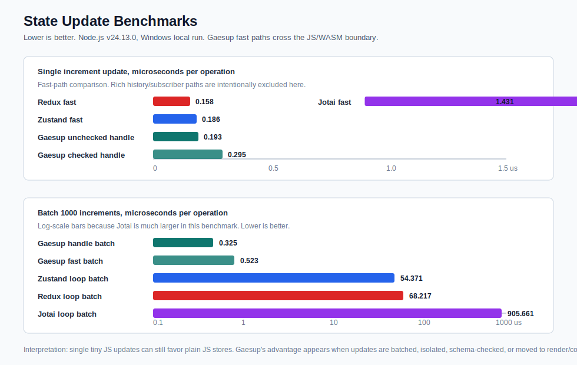

# Gaesup-State

[](https://www.npmjs.com/package/gaesup-state)
[](https://www.npmjs.com/package/gaesup-state)
[](./LICENSE)
[](https://www.npmjs.com/package/gaesup-state)
[](./packages/core-rust)
[](./packages/core/src/auto-store.test.ts)



Gaesup-State는 프론트엔드에서 여러 화면, 여러 프레임워크, 여러 WASM 패키지가 같은 상태를 안전하게 공유하도록 만드는 Rust/WASM 기반 상태관리 실험입니다.

처음 목표는 React, Vue, Svelte, Angular 데모가 같은 카운터를 공유하는 것이었습니다. 지금은 한 단계 더 나아가서 WASM 패키지를 브라우저 안의 작은 컨테이너처럼 다루고, 패키지가 요구하는 의존성, store schema, ABI, accelerator 조건을 실행 전에 검사하는 방향으로 확장했습니다.

일반 사용자 입장에서는 상태관리 라이브러리처럼 쓸 수 있어야 합니다. 그래서 낮은 수준의 `GaesupCore` API 위에 `gaesup`, `atom`, `watch`, `resource/query` 같은 짧은 API를 올렸습니다. 복잡한 곳은 Rust/WASM core가 맡고, 프레임워크 코드는 필요한 만큼만 JS 경계로 끌어올리는 구성이 목표입니다.

## 지금 되는 것

- Rust/WASM 기반 named store
- `createStore`, `dispatch`, `select`, `subscribe`, `snapshot`, `metrics`
- React, Vue, Svelte, Angular 데모에서 하나의 store 공유
- WASM 패키지 manifest 검증
- host 의존성과 bundled 의존성 분리
- store schema 충돌 시 `reject` 또는 `isolate` 정책 적용
- CUDA/WebGPU 같은 accelerator 요구사항 검증 모델
- R3F/WebGPU를 염두에 둔 render state fast path
- dirty matrix buffer 기반 프레임 갱신
- 객체 직접 수정형 auto store
- selector 의존성 추적 기반 `watch`
- API 상태까지 store로 다루는 `resource/query`
- Rust 단위 테스트와 TypeScript 테스트

## 왜 필요한가

프론트엔드가 커지면 상태와 의존성이 같이 꼬입니다.

- 여러 프레임워크가 같은 상태를 각자 들고 있어서 화면마다 값이 다르게 보임
- 한 WASM 패키지가 요구하는 라이브러리 버전이 host 버전과 충돌함
- store schema가 맞지 않는데 공유 상태에 붙어서 상태가 깨짐
- 3D 화면에서 매 프레임 React 상태를 건드려 렌더 비용이 커짐
- API 상태는 React Query, UI 상태는 Zustand/Jotai, 패키지 상태는 별도 store처럼 흩어짐

Gaesup-State는 이 문제를 세 가지로 나눠 봅니다.

1. 상태는 Rust/WASM core에 둡니다.
2. WASM 패키지는 manifest로 의존성과 store 계약을 선언합니다.
3. 화면 갱신은 가능한 한 typed buffer와 fast path로 처리합니다.

## 빠른 실행

```bash
corepack enable
corepack prepare pnpm@8.10.0 --activate
pnpm install
pnpm run build:wasm
pnpm --filter gaesup-state run build
pnpm --filter @gaesup-state/multi-framework-demo run dev -- --host 0.0.0.0
```

브라우저에서 엽니다.

```text
http://localhost:3000/
```

데모에서는 네 가지를 확인합니다.

- 공유 카운터: React, Vue, Svelte, Angular 카드가 같은 Rust/WASM store를 봅니다. 어느 카드에서 `+1`을 눌러도 다른 카드가 같이 올라가야 정상입니다.
- 의존성 격리: host 의존성을 쓰는 패키지, bundled 의존성으로 실행되는 패키지, store schema가 맞지 않아 격리되는 패키지, host 충돌로 차단되는 패키지를 확인합니다.
- render runtime: 3D/R3F 계열을 염두에 둔 dirty matrix buffer 흐름을 확인합니다.
- 성능 벤치마크: Zustand, Jotai, Redux 스타일 업데이트와 Gaesup fast path를 비교합니다.

## 기본 사용법

낮은 수준 API는 `GaesupCore`입니다.

```typescript
import { GaesupCore } from 'gaesup-state';

await GaesupCore.createStore('orders', { count: 0 });

await GaesupCore.dispatch('orders', 'MERGE', { count: 1 });

const count = GaesupCore.select('orders', 'count');
```

구독은 callback을 등록한 뒤 store에 연결합니다.

```typescript
GaesupCore.registerCallback('orders-listener', (state) => {
  console.log(state);
});

const subscriptionId = GaesupCore.subscribe('orders', '', 'orders-listener');

GaesupCore.unsubscribe(subscriptionId);
GaesupCore.unregisterCallback('orders-listener');
```

## 코드량을 줄이는 auto store

상태관리 코드를 더 줄이고 싶으면 `gaesup`을 씁니다. 객체를 수정하면 변경 path가 자동으로 추적되고 microtask 단위로 Rust store에 반영됩니다.

```typescript
import { gaesup } from 'gaesup-state';

const counter = gaesup({
  count: 0,
  user: { name: 'Ada' }
});

await counter.$ready;

counter.count += 1;
counter.user.name = 'Grace';
```

하위 객체를 변수로 빼서 수정해도 추적됩니다.

```typescript
const user = counter.user;
user.name = 'Tracked';
```

selector가 읽은 path만 보고 싶으면 `watch`를 씁니다. 계속 polling하지 않고, proxy read를 통해 의존성을 모읍니다.

```typescript
import { watch } from 'gaesup-state';

const off = watch(
  counter,
  (state) => state.user.name,
  (name) => console.log(name)
);

counter.count += 1;       // listener를 다시 부르지 않습니다.
counter.user.name = 'Lin'; // listener를 다시 부릅니다.

off();
```

직접 여러 action을 보낼 때는 pipeline으로 묶을 수 있습니다.

```typescript
const pipe = GaesupCore.pipeline('counter', {
  autoFlush: false
});

pipe.update('count', 1);
pipe.update('user.name', 'Grace');

await pipe.flush();
```

같은 tick 안의 여러 변경은 Rust/WASM으로 `BATCH` 한 번만 나갑니다. 같은 path를 여러 번 바꾸면 마지막 값만 남깁니다.

작은 값 하나만 필요하면 `atom`을 씁니다.

```typescript
import { atom } from 'gaesup-state';

const count = atom(0);

count.value += 1;
await count.set((value) => value + 1);
```

## API 상태까지 같이 쓰기

React Query와 별도 store를 같이 쓰는 게 번거로울 때는 `resource` 또는 `query`를 씁니다. API 상태도 같은 store 객체로 다룹니다.

```typescript
import { resource } from 'gaesup-state';

const todos = resource('todos', async () => {
  const response = await fetch('/api/todos');
  return response.json() as Promise<Array<{ id: number; title: string }>>;
});

await todos.$ready;
await todos.refetch();

console.log(todos.status);
console.log(todos.data);
```

낙관적 업데이트와 invalidate도 같은 객체에서 처리합니다.

```typescript
await todos.mutate((previous = []) => [
  ...previous,
  { id: Date.now(), title: 'local first' }
]);

await todos.invalidate();
```

자동 fetch를 끄고 필요한 시점에 호출할 수도 있습니다.

```typescript
const search = resource(
  ['search', 'users'],
  ({ q }: { q: string }) => fetchUsers(q),
  { enabled: false }
);

await search.refetch({ q: 'ada' });
```

`query`는 `resource`의 alias입니다.

```typescript
import { query } from 'gaesup-state';

const orders = query('orders', fetchOrders);
```

## class 방식

decorator를 쓰는 프로젝트라면 class를 상태처럼 사용할 수 있습니다.

```typescript
import { GaesupStore } from 'gaesup-state';

@GaesupStore('counter')
class CounterState {
  count = 0;
  user = { name: 'Ada' };

  inc() {
    this.count += 1;
  }
}

const counter = new CounterState();

await counter.$ready;

counter.inc();
counter.user.name = 'Grace';
```

## 빠른 숫자 업데이트

카운터처럼 아주 자주 발생하는 업데이트에는 전용 fast path를 씁니다.

```typescript
await GaesupCore.dispatchCounterFast('shared', 1);
await GaesupCore.dispatchCounterBatchFast('shared', 1, 1000);
```

프레임 루프에서는 handle을 만들어 `storeId` 문자열 lookup 비용까지 줄일 수 있습니다.

```typescript
const handle = await GaesupCore.createCounterHandle('shared');

await GaesupCore.dispatchCounterHandleFast(handle, 1);
await GaesupCore.dispatchCounterHandleBatchFast(handle, 1, 1000);
```

## 의존성 격리 모델

WASM 패키지는 manifest에 필요한 의존성을 적습니다.

```typescript
const manifest = {
  manifestVersion: '1.0',
  name: 'orders-widget',
  version: '1.0.0',
  gaesup: { abiVersion: '^1.0.0' },
  dependencies: [
    { name: 'date-fns', version: '^2.29.0', source: 'host' }
  ],
  stores: [
    {
      storeId: 'orders',
      schemaId: 'orders-state',
      schemaVersion: '^1.2.0',
      conflictPolicy: 'reject'
    }
  ]
};
```

의존성은 두 방식으로 처리합니다.

| 방식 | 의미 |
| --- | --- |
| `source: 'host'` | host가 제공하는 라이브러리 버전을 사용합니다. 버전 범위가 맞아야 실행합니다. |
| `source: 'bundled'` | 패키지 안에 들어 있는 라이브러리를 사용합니다. host dependency graph를 바꾸지 않습니다. |

예를 들어 host가 `chart.js@4.4.3`을 제공하는데 패키지가 `chart.js@^3.9.0`을 요구한다면, `source: 'host'`는 차단됩니다. 하지만 `source: 'bundled'`라면 패키지 내부의 chart.js 3으로 실행할 수 있습니다.

store schema가 맞지 않을 때는 공유 store에 붙이지 않습니다. 정책이 `isolate`라면 컨테이너 전용 namespace로 격리해서 실행할 수 있고, `reject`라면 실행을 막습니다.

## 3D와 render runtime

R3F 같은 3D 화면에서는 React state를 매 프레임 건드리면 비용이 커집니다. Gaesup-State의 render runtime은 프레임마다 JS 객체를 많이 만들지 않고, dirty matrix buffer만 갱신하는 방향을 잡고 있습니다.

```typescript
import { GaesupRender, GaesupRenderBridge } from 'gaesup-state';

const render = new GaesupRender();
const bridge = new GaesupRenderBridge(render);

const entity = render.createEntity({
  position: [0, 0, 0],
  rotation: [0, 0, 0, 1],
  scale: [1, 1, 1]
});

bridge.queueTransform(entity, {
  position: [1, 0, 0]
});

bridge.flush();
```

현재 브라우저에서는 WebGPU/R3F 호출 자체가 JS API를 지나야 합니다. 그래서 경계를 완전히 없앤다기보다, 매 프레임 넘어가는 데이터를 작고 일정하게 만드는 것이 현실적인 목표입니다.

## 성능 확인

상태관리 비교와 병목 탐색 스크립트가 있습니다. `pnpm bench`는 WASM 빌드 후 전체 벤치마크를 실행하고, 개별 스크립트는 비교 대상이나 병목만 따로 볼 때 씁니다.

```bash
pnpm bench
pnpm bench:compare
pnpm bench:bottleneck
```

비교 기준은 세 가지입니다.

1. 일반 UI 상태는 Zustand, Jotai, Redux와 같은 JS 상태관리 라이브러리와 비교합니다.
2. 초고빈도 카운터 업데이트는 JS/WASM 경계 비용을 줄인 fast path와 handle path를 따로 측정합니다.
3. 렌더링 상태는 JSON patch보다 typed buffer와 dirty matrix buffer가 유리한 경우를 확인합니다.

핵심 결과는 `docs/performance.md`에 정리되어 있습니다. 일반 auto store는 편의성을 위한 경로이고, 초고빈도 업데이트는 counter handle fast path 또는 render runtime을 쓰는 구성이 좋습니다.

## 저장소 구조

```text
gaesup-store/
├─ packages/
│  ├─ core/              # TypeScript API wrapper
│  ├─ core-rust/         # Rust/WASM core
│  ├─ frameworks/        # React, Vue, Svelte, Angular adapters
│  └─ registry/          # Filesystem-backed WASM container registry
├─ examples/
│  └─ multi-framework-demo/
├─ tools/
│  └─ container-builder/
├─ docs/
├─ docker/
└─ benchmarks/
```

## 개발 명령

```bash
pnpm install
pnpm run build:wasm
pnpm --filter gaesup-state run test
pnpm --filter gaesup-state run type-check
pnpm --filter gaesup-state run build
pnpm --filter @gaesup-state/multi-framework-demo run dev
```

## 문서

- [문서 홈](./docs/README.md)
- [빠른 시작](./docs/quick-start.md)
- [API 레퍼런스](./docs/api-reference.md)
- [Auto store](./docs/auto-store.md)
- [Resource와 query](./docs/resource-query.md)
- [Dispatch pipeline](./docs/pipeline.md)
- [npm 배포 준비](./docs/npm-publish.md)
- [성능 메모](./docs/performance.md)
- [렌더 런타임](./docs/render-runtime.md)
- [Docker와 WASM 패키징](./docs/docker-integration.md)

## 어떤 API부터 보면 되나

| 상황 | 먼저 볼 것 |
| --- | --- |
| Zustand/Jotai처럼 짧게 상태를 쓰고 싶음 | `gaesup`, `atom`, `watch` |
| 객체 하위 값을 직접 바꾸고 싶음 | `gaesup` auto store |
| React Query와 store를 따로 쓰기 싫음 | `resource` 또는 `query` |
| 여러 dispatch가 같은 tick에 몰림 | `GaesupCore.pipeline` |
| 카운터처럼 숫자 하나를 매우 자주 바꿈 | counter handle fast path |
| R3F/WebGPU 프레임 상태를 다룸 | `GaesupRender`, dirty matrix buffer |
| WASM 패키지 의존성 충돌을 막고 싶음 | manifest와 compatibility guard |

## 현재 판단

Gaesup-State는 Zustand/Jotai를 단순히 대체하려는 라이브러리라기보다, WASM 컨테이너, 의존성 격리, 공유 store 계약, 3D render state까지 한 번에 묶으려는 코어입니다. 일반 UI 상태는 `gaesup`과 `resource`로 짧게 쓰고, 프레임 단위 또는 초고빈도 업데이트는 Rust/WASM fast path로 내려보내는 방향이 가장 잘 맞습니다.
