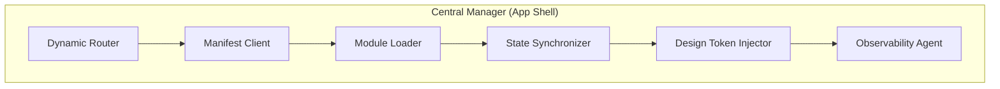
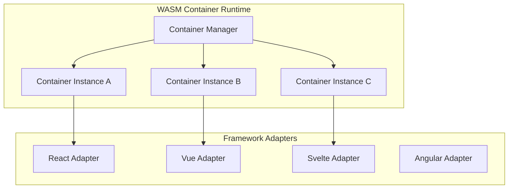
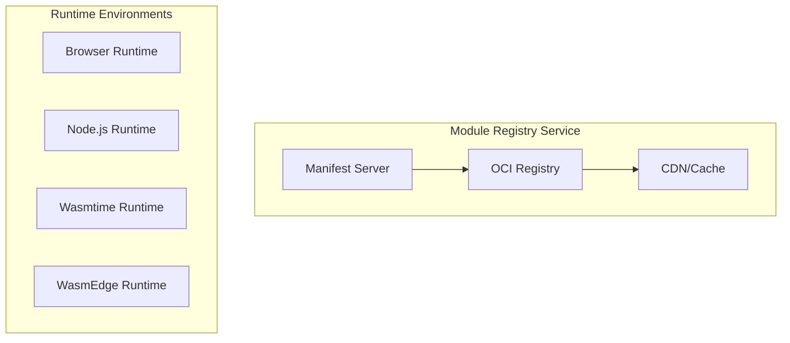
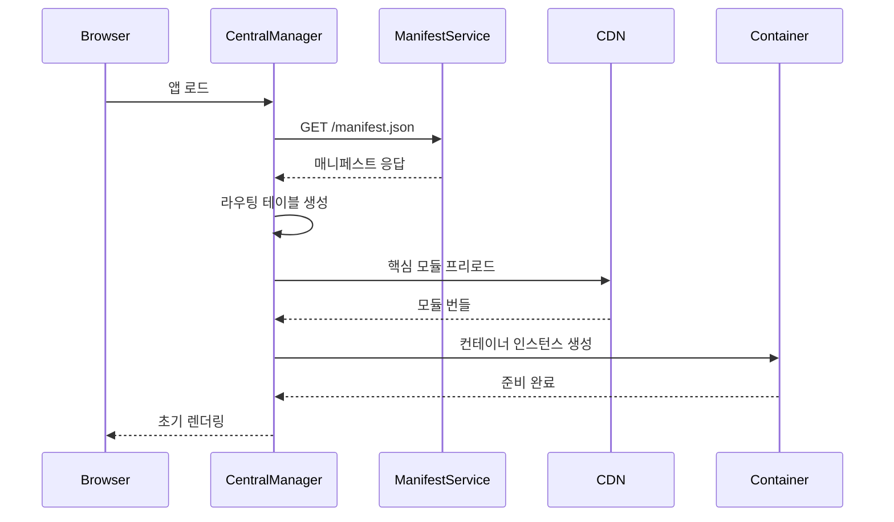
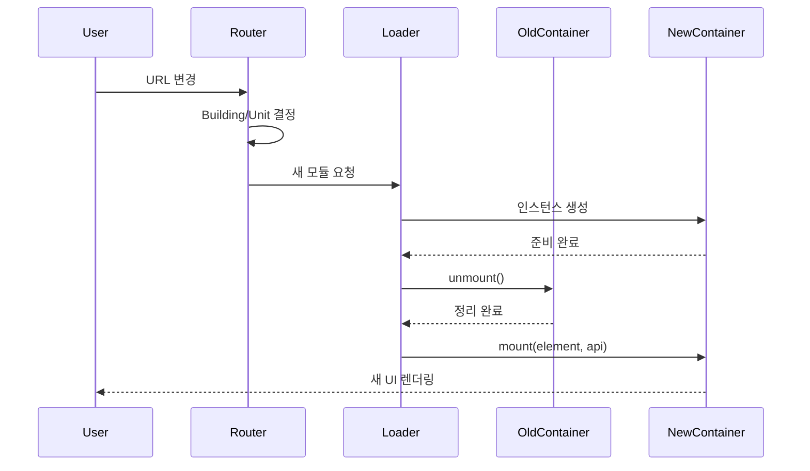
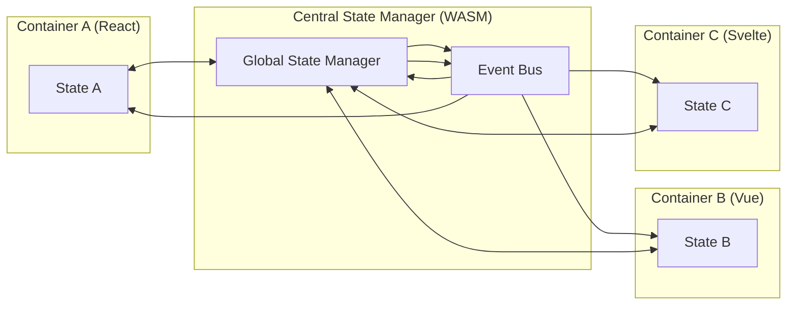

# 1. 전체 아키텍처 개요 - Apartment 시스템 설계

## 1.1 개념적 배경

### 문제 정의
현재 프론트엔드 생태계의 주요 문제점들:
- **프레임워크 혼재**: 같은 조직 내에서도 React, Vue, Svelte 등 다양한 프레임워크 사용
- **배포 복잡성**: 모노레포 전체 재빌드로 인한 긴 배포 시간과 롤백 어려움
- **스타일 불일치**: 독립 모듈 간 디자인 토큰 및 UI 일관성 부족
- **상태 분산**: 모듈 간 상태 공유 및 동기화 복잡성
- **관측 어려움**: 분산된 모듈들의 통합 모니터링 부족

### 해결 접근법: "아파트 단지" 메타포
실제 아파트 단지 관리 방식을 프론트엔드 아키텍처에 적용:

```
🏢 Apartment (아파트 단지) = 전체 애플리케이션
├── 🏗️ Building 1 (1동) = Header 영역
│   ├── 🏠 Unit 101 = React Header v1.2.0
│   ├── 🏠 Unit 102 = Svelte Header v2.0.0
│   └── 🏠 Unit 103 = Vue Header v1.5.1
├── 🏗️ Building 2 (2동) = Main Page 영역  
│   ├── 🏠 Unit 201 = React Dashboard v3.1.0
│   ├── 🏠 Unit 202 = Vue Analytics v2.0.0
│   └── 🏠 Unit 203 = Svelte Board v1.0.0
└── 🏗️ Building 3 (3동) = Footer 영역
    └── 🏠 Unit 301 = WASM Footer v0.9.0
```

## 1.2 핵심 아키텍처 구조

### Layer 1: Central Management (중앙 관리층)


**역할:**
- **Dynamic Router**: URL → Building/Unit 매핑 및 라우팅
- **Manifest Client**: 모듈 매니페스트 캐싱 및 버전 관리
- **Module Loader**: ESM/WASM 모듈 동적 로딩 및 인스턴스화
- **State Synchronizer**: 크로스 모듈 상태 동기화
- **Design Token Injector**: 전역 CSS 변수 및 테마 관리
- **Observability Agent**: 통합 로깅, 메트릭, 추적

### Layer 2: Module Runtime (모듈 실행층)


**구성요소:**
- **Container Manager**: WASM 컨테이너 라이프사이클 관리
- **Container Instances**: 격리된 실행 환경의 개별 인스턴스
- **Framework Adapters**: 각 프레임워크별 특화된 연결 어댑터

### Layer 3: Infrastructure (인프라층)


## 1.3 주소 체계 설계

### URL 기반 모듈 주소 체계
```
/apartment/{apartment-id}/building/{building-id}/unit/{unit-id}

예시:
/apartment/gaesup-main/building/header/unit/react-v1-2-0
/apartment/gaesup-main/building/dashboard/unit/vue-v2-0-0
/apartment/gaesup-admin/building/sidebar/unit/svelte-v1-5-0
```

### 매니페스트 기반 매핑
```json
{
  "apartments": {
    "gaesup-main": {
      "name": "Gaesup Main Application",
      "version": "3.0.0",
      "buildings": {
        "header": {
          "name": "Application Header",
          "active_unit": "react-v1-2-0",
          "units": {
            "react-v1-2-0": {
              "framework": "react",
              "version": "1.2.0",
              "url": "https://cdn.gaesup.dev/header-react@1.2.0.js",
              "wasm_url": "https://cdn.gaesup.dev/header-react@1.2.0.wasm",
              "checksum": "sha256:abc123...",
              "dependencies": ["@gaesup/design-tokens@2.0.0"],
              "compatibility": ">=3.0.0 <4.0.0"
            },
            "svelte-v2-0-0": {
              "framework": "svelte", 
              "version": "2.0.0",
              "url": "https://cdn.gaesup.dev/header-svelte@2.0.0.js",
              "status": "beta",
              "rollout_percentage": 10
            }
          }
        },
        "dashboard": {
          "name": "Main Dashboard",
          "active_unit": "vue-v2-0-0",
          "units": {
            "vue-v2-0-0": {
              "framework": "vue",
              "version": "2.0.0",
              "url": "https://cdn.gaesup.dev/dashboard-vue@2.0.0.js"
            }
          }
        }
      }
    }
  }
}
```

## 1.4 데이터 흐름 설계

### 1. 부팅 시퀀스


### 2. 라우팅 및 모듈 교체


### 3. 상태 동기화 흐름


## 1.5 핵심 기술 스택

### Frontend Technologies
- **Core Runtime**: Rust + WebAssembly (고성능 상태 관리)
- **Framework Adapters**: TypeScript (React/Vue/Svelte/Angular 통합)
- **Module Loading**: ESM 동적 import + WebAssembly.instantiate
- **State Management**: 중앙집중식 WASM Store + 프레임워크별 바인딩
- **Routing**: URL 기반 동적 라우팅 + History API

### Backend Services
- **Manifest Service**: Node.js + Express (매니페스트 관리 API)
- **Registry Service**: OCI 호환 컨테이너 레지스트리
- **CDN**: CloudFront/Cloudflare (모듈 배포)
- **Monitoring**: OpenTelemetry + Prometheus + Grafana

### Build & Deployment
- **Build Tools**: wasm-pack, Vite, Webpack 5 (Module Federation)
- **Container Format**: OCI 이미지 스펙 준수
- **CI/CD**: GitHub Actions + ArgoCD
- **Versioning**: Semantic Versioning + Compatibility Matrix

## 1.6 핵심 설계 원칙

### 1. 격리와 독립성
- 각 Unit은 완전히 격리된 실행 환경 보유
- 하나의 Unit 장애가 다른 Unit에 영향 없음
- 독립적인 빌드, 테스트, 배포 파이프라인

### 2. 점진적 마이그레이션
- 기존 애플리케이션을 한 번에 전환할 필요 없음
- Building 단위로 점진적 전환 가능
- 레거시 시스템과 공존 가능

### 3. 성능 최적화
- WASM 기반 고성능 상태 관리
- 지능적 프리로딩 및 캐싱
- 최소한의 번들 크기 유지

### 4. 개발자 경험
- 프레임워크별 네이티브 API 유지
- 로컬 개발 환경 간소화
- 강력한 타입 안정성

### 5. 운영 우수성
- 상세한 관측성 및 모니터링
- 빠른 롤백 메커니즘
- 자동화된 성능 분석

## 1.7 아키텍처 장점

### 기술적 장점
1. **프레임워크 독립성**: 팀별로 선호하는 프레임워크 사용 가능
2. **성능 향상**: WASM 기반으로 기존 대비 10-50배 빠른 상태 관리
3. **메모리 효율성**: 격리된 컨테이너로 메모리 누수 방지
4. **보안 강화**: WASM 샌드박스 + 권한 기반 접근 제어

### 비즈니스 장점
1. **빠른 배포**: 모듈별 독립 배포로 배포 시간 단축
2. **위험 감소**: 부분 롤백 가능으로 전체 시스템 영향 최소화
3. **팀 자율성**: 각 팀이 독립적으로 기술 스택 결정
4. **비용 절감**: 필요한 모듈만 스케일링하여 인프라 비용 최적화

## 1.8 구현 로드맵

### Phase 1: Foundation (1-2개월)
- Central Manager 핵심 기능 구현
- 기본 라우팅 시스템 구축
- WASM State Manager 프로토타입

### Phase 2: Integration (2-3개월)
- 프레임워크별 어댑터 개발
- Manifest Service 구축
- 기본 모니터링 시스템

### Phase 3: Production Ready (3-4개월)
- 보안 및 권한 시스템 구현
- CI/CD 파이프라인 구축
- 성능 최적화 및 스케일링

### Phase 4: Advanced Features (4-6개월)
- 고급 배포 전략 (Blue-Green, Canary)
- AI 기반 성능 최적화
- 개발자 도구 및 디버거

## 1.9 예상 도전 과제

### 기술적 도전
1. **WASM 디버깅**: 브라우저에서 WASM 디버깅 도구 제한
2. **초기 로딩 시간**: 여러 모듈 로드로 인한 FCP 지연
3. **상태 동기화**: 실시간 상태 동기화의 복잡성

### 조직적 도전
1. **학습 곡선**: 새로운 아키텍처에 대한 팀 교육 필요
2. **마이그레이션 비용**: 기존 시스템 전환 비용
3. **표준화**: 팀 간 개발 표준 수립

## 1.10 결론

Gaesup-State의 Apartment 아키텍처는 현대적인 프론트엔드 개발의 복잡성을 해결하는 혁신적인 접근법입니다. WASM의 성능, Docker의 격리성, 그리고 마이크로 프론트엔드의 유연성을 결합하여, 대규모 조직이 직면한 기술적, 조직적 문제를 동시에 해결합니다.

이 아키텍처를 통해 팀은 더 빠르고, 안전하며, 독립적으로 혁신할 수 있게 되며, 사용자는 더 빠르고 일관된 경험을 누릴 수 있습니다. 