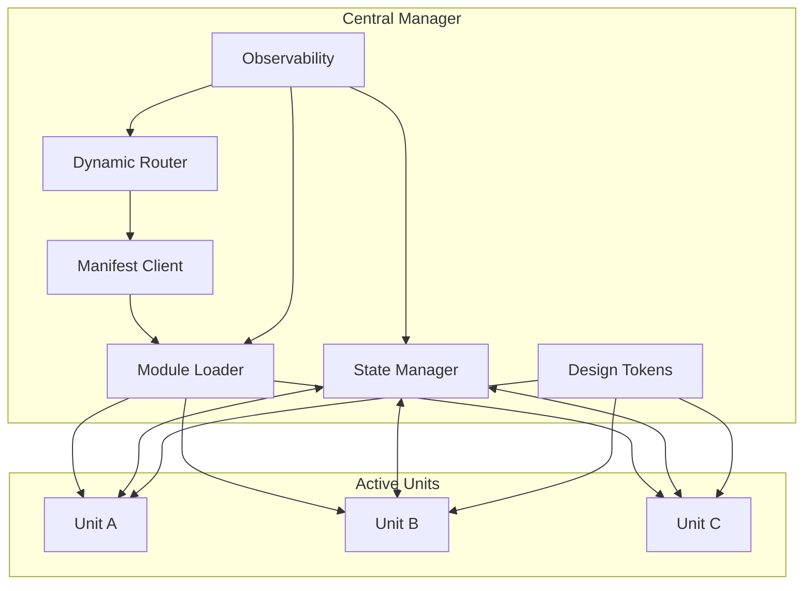

# 2. Central Manager (App Shell) 구현 계획

## 2.1 Central Manager 개요

Central Manager는 Apartment 시스템의 핵심 조정자(Orchestrator)로서, 모든 모듈의 라이프사이클을 관리하고 통합된 사용자 경험을 제공합니다.

### 주요 책임
- **라우팅**: URL 기반 Building/Unit 선택 및 네비게이션
- **모듈 관리**: 동적 로딩, 인스턴스화, 라이프사이클 관리
- **상태 조정**: 크로스 모듈 상태 동기화 및 이벤트 중재
- **자원 최적화**: 메모리, CPU, 네트워크 자원의 효율적 활용
- **에러 처리**: 장애 격리, 복구, 사용자 경험 보호

## 2.2 아키텍처 설계

### 2.2.1 Core Components

```typescript
interface CentralManagerConfig {
  apartmentId: string                 // 현재 아파트 식별자
  manifestUrl: string                // 매니페스트 서비스 URL
  cacheTTL: number                   // 캐시 유효 시간 (초)
  maxConcurrentUnits: number         // 최대 동시 실행 Unit 수
  fallbackStrategy: FallbackStrategy // 실패 시 폴백 전략
  observability: ObservabilityConfig // 관측성 설정
  security: SecurityConfig           // 보안 정책
}

class CentralManager {
  private router: DynamicRouter
  private manifestClient: ManifestClient
  private moduleLoader: ModuleLoader
  private stateManager: StateManager
  private tokenInjector: DesignTokenInjector
  private observabilityAgent: ObservabilityAgent
  private errorBoundary: ErrorBoundary
  
  constructor(config: CentralManagerConfig)
  async initialize(): Promise<void>
  async shutdown(): Promise<void>
}
```

### 2.2.2 Module Interaction Flow



## 2.3 Dynamic Router 구현

### 2.3.1 라우팅 테이블 구조

```typescript
interface RoutingEntry {
  path: string                    // URL 패턴
  buildingId: string             // 대상 Building
  unitSelector: UnitSelector     // Unit 선택 로직
  guards: RouteGuard[]           // 접근 제어
  preload?: string[]             // 사전 로드할 의존성
  metadata: RouteMetadata        // 라우팅 메타데이터
}

interface UnitSelector {
  strategy: 'active' | 'canary' | 'ab_test' | 'custom'
  config: Record<string, any>
}

interface RouteGuard {
  type: 'auth' | 'permission' | 'feature_flag' | 'custom'
  validate(context: RouteContext): Promise<boolean>
}
```

### 2.3.2 Dynamic Router 구현

```typescript
class DynamicRouter {
  private routes: Map<string, RoutingEntry> = new Map()
  private activeUnits: Map<string, UnitInstance> = new Map()
  private history: RouterHistory
  
  constructor(private manager: CentralManager) {
    this.setupHistoryListener()
  }
  
  async navigate(path: string, options?: NavigationOptions): Promise<void> {
    const startTime = performance.now()
    
    try {
      // 1. 라우트 매칭
      const route = this.matchRoute(path)
      if (!route) throw new RouteNotFoundError(path)
      
      // 2. 가드 검증
      const guardsPassed = await this.runGuards(route.guards)
      if (!guardsPassed) throw new RouteGuardError(path)
      
      // 3. Unit 선택
      const unit = await this.selectUnit(route)
      
      // 4. 현재 Unit 언마운트
      await this.unmountCurrentUnit(route.buildingId)
      
      // 5. 새 Unit 마운트
      await this.mountUnit(unit, route)
      
      // 6. 히스토리 업데이트
      this.history.push(path, { route, unit })
      
      // 7. 메트릭 기록
      this.recordNavigation(path, performance.now() - startTime)
      
    } catch (error) {
      await this.handleNavigationError(error, path)
    }
  }
  
  private async selectUnit(route: RoutingEntry): Promise<UnitDefinition> {
    const { unitSelector } = route
    
    switch (unitSelector.strategy) {
      case 'active':
        return this.getActiveUnit(route.buildingId)
        
      case 'canary':
        return this.selectCanaryUnit(route.buildingId, unitSelector.config)
        
      case 'ab_test':
        return this.selectABTestUnit(route.buildingId, unitSelector.config)
        
      case 'custom':
        return unitSelector.config.selector(route)
    }
  }
}
```

## 2.4 Manifest Client 구현

### 2.4.1 매니페스트 구조

```typescript
interface Manifest {
  version: string
  timestamp: number
  apartments: Record<string, ApartmentDefinition>
  globalConfig: GlobalConfig
  checksums: Record<string, string>
}

interface ApartmentDefinition {
  id: string
  name: string
  version: string
  buildings: Record<string, BuildingDefinition>
  dependencies: DependencyDefinition[]
  metadata: ApartmentMetadata
}

interface BuildingDefinition {
  id: string
  name: string
  activeUnit: string
  units: Record<string, UnitDefinition>
  layout: LayoutDefinition
  permissions: Permission[]
}

interface UnitDefinition {
  id: string
  framework: 'react' | 'vue' | 'svelte' | 'angular' | 'vanilla'
  version: string
  url: string
  wasmUrl?: string
  integrity: string
  dependencies: string[]
  config: UnitConfig
  status: 'stable' | 'beta' | 'experimental'
  rollout: RolloutConfig
}
```

### 2.4.2 Manifest Client 구현

```typescript
class ManifestClient {
  private cache: ManifestCache
  private fetcher: ManifestFetcher
  private validator: ManifestValidator
  
  constructor(
    private config: ManifestClientConfig,
    private observability: ObservabilityAgent
  ) {
    this.cache = new ManifestCache(config.cacheTTL)
    this.fetcher = new ManifestFetcher(config.manifestUrl)
    this.validator = new ManifestValidator()
  }
  
  async getManifest(options?: FetchOptions): Promise<Manifest> {
    // 1. 캐시 확인
    const cached = await this.cache.get('manifest')
    if (cached && !options?.force) {
      return cached
    }
    
    // 2. 서버에서 가져오기
    const manifest = await this.fetcher.fetch({
      etag: cached?.etag,
      timeout: options?.timeout || 5000
    })
    
    // 3. 검증
    await this.validator.validate(manifest)
    
    // 4. 캐시 업데이트
    await this.cache.set('manifest', manifest)
    
    // 5. 변경 사항 알림
    this.notifyManifestChange(manifest, cached)
    
    return manifest
  }
  
  async getUnit(buildingId: string, unitId: string): Promise<UnitDefinition> {
    const manifest = await this.getManifest()
    const apartment = manifest.apartments[this.config.apartmentId]
    const building = apartment?.buildings[buildingId]
    const unit = building?.units[unitId]
    
    if (!unit) {
      throw new UnitNotFoundError(buildingId, unitId)
    }
    
    return unit
  }
  
  watchChanges(callback: (manifest: Manifest) => void): () => void {
    // WebSocket 또는 Polling으로 매니페스트 변경 감지
    const subscription = this.fetcher.subscribe(async (update) => {
      const manifest = await this.getManifest({ force: true })
      callback(manifest)
    })
    
    return () => subscription.unsubscribe()
  }
}
```

## 2.5 Module Loader 구현

### 2.5.1 로더 아키텍처

```typescript
interface ModuleLoader {
  load(unit: UnitDefinition): Promise<ModuleInstance>
  preload(units: UnitDefinition[]): Promise<void>
  unload(unitId: string): Promise<void>
  getLoadedModules(): Map<string, ModuleInstance>
}

interface ModuleInstance {
  id: string
  unit: UnitDefinition
  exports: ModuleExports
  container?: WASMContainer
  state: ModuleState
  metrics: ModuleMetrics
}

interface ModuleExports {
  mount(element: HTMLElement, api: ModuleAPI): Promise<void>
  unmount(): Promise<void>
  update?(props: any): Promise<void>
  getState?(): any
}
```

### 2.5.2 Module Loader 구현

```typescript
class ModuleLoaderImpl implements ModuleLoader {
  private loadedModules: Map<string, ModuleInstance> = new Map()
  private loadingPromises: Map<string, Promise<ModuleInstance>> = new Map()
  private wasmRuntime: WASMRuntime
  
  constructor(
    private config: ModuleLoaderConfig,
    private security: SecurityManager
  ) {
    this.wasmRuntime = new WASMRuntime(config.wasmConfig)
  }
  
  async load(unit: UnitDefinition): Promise<ModuleInstance> {
    // 1. 이미 로드된 경우
    const loaded = this.loadedModules.get(unit.id)
    if (loaded) return loaded
    
    // 2. 로딩 중인 경우
    const loading = this.loadingPromises.get(unit.id)
    if (loading) return loading
    
    // 3. 새로 로드
    const loadPromise = this.loadModule(unit)
    this.loadingPromises.set(unit.id, loadPromise)
    
    try {
      const instance = await loadPromise
      this.loadedModules.set(unit.id, instance)
      return instance
    } finally {
      this.loadingPromises.delete(unit.id)
    }
  }
  
  private async loadModule(unit: UnitDefinition): Promise<ModuleInstance> {
    const startTime = performance.now()
    
    try {
      // 1. 보안 검증
      await this.security.validateUnit(unit)
      
      // 2. 의존성 로드
      await this.loadDependencies(unit.dependencies)
      
      // 3. 모듈 로드
      let exports: ModuleExports
      let container: WASMContainer | undefined
      
      if (unit.wasmUrl) {
        // WASM 모듈 로드
        container = await this.loadWASMModule(unit)
        exports = this.createWASMExports(container)
      } else {
        // JavaScript 모듈 로드
        exports = await this.loadJSModule(unit)
      }
      
      // 4. 인스턴스 생성
      const instance: ModuleInstance = {
        id: unit.id,
        unit,
        exports,
        container,
        state: 'loaded',
        metrics: {
          loadTime: performance.now() - startTime,
          memoryUsage: 0,
          lastActive: Date.now()
        }
      }
      
      // 5. 초기화
      await this.initializeModule(instance)
      
      return instance
      
    } catch (error) {
      this.handleLoadError(unit, error)
      throw error
    }
  }
  
  private async loadWASMModule(unit: UnitDefinition): Promise<WASMContainer> {
    // WASM 바이트코드 가져오기
    const wasmBytes = await fetch(unit.wasmUrl!).then(r => r.arrayBuffer())
    
    // 무결성 검증
    await this.verifyIntegrity(wasmBytes, unit.integrity)
    
    // WASM 컨테이너 생성
    const container = await this.wasmRuntime.createContainer({
      id: unit.id,
      wasmBytes,
      memory: unit.config.memory || DEFAULT_MEMORY,
      permissions: unit.config.permissions || []
    })
    
    return container
  }
  
  private async loadJSModule(unit: UnitDefinition): Promise<ModuleExports> {
    // 동적 import
    const module = await import(/* @vite-ignore */ unit.url)
    
    // 표준 인터페이스 검증
    if (!module.mount || typeof module.mount !== 'function') {
      throw new InvalidModuleError('Module must export mount function')
    }
    
    return module
  }
}
```

## 2.6 State Manager 구현

### 2.6.1 상태 관리 아키텍처

```typescript
interface StateManager {
  createStore(storeId: string, initialState: any): void
  getState(storeId: string, path?: string): any
  dispatch(storeId: string, action: Action): void
  subscribe(storeId: string, listener: StateListener): () => void
  bridge(sourceStore: string, targetStore: string, mapping: StateMapping): void
}

interface StateStore {
  id: string
  state: any
  reducers: Map<string, Reducer>
  middleware: Middleware[]
  subscribers: Set<StateListener>
  bridges: Map<string, StateBridge>
}

interface StateBridge {
  source: string
  target: string
  mapping: StateMapping
  transformer?: StateTransformer
  filter?: StateFilter
}
```

### 2.6.2 State Manager 구현

```typescript
class StateManagerImpl implements StateManager {
  private stores: Map<string, StateStore> = new Map()
  private wasmCore: WASMStateCore
  private eventBus: EventBus
  
  constructor(config: StateManagerConfig) {
    this.wasmCore = new WASMStateCore(config.wasmConfig)
    this.eventBus = new EventBus()
    this.setupCrossUnitSync()
  }
  
  createStore(storeId: string, initialState: any): void {
    // WASM 코어에 스토어 생성
    this.wasmCore.createStore(storeId, initialState)
    
    // 로컬 스토어 래퍼 생성
    const store: StateStore = {
      id: storeId,
      state: initialState,
      reducers: new Map(),
      middleware: [],
      subscribers: new Set(),
      bridges: new Map()
    }
    
    this.stores.set(storeId, store)
    
    // WASM 상태 변경 구독
    this.wasmCore.subscribe(storeId, (newState) => {
      this.handleStateChange(storeId, newState)
    })
  }
  
  dispatch(storeId: string, action: Action): void {
    const store = this.stores.get(storeId)
    if (!store) throw new StoreNotFoundError(storeId)
    
    // 미들웨어 체인 실행
    const chain = this.applyMiddleware(store, action)
    
    // WASM 코어로 디스패치
    const newState = this.wasmCore.dispatch(storeId, chain)
    
    // 브리지된 스토어로 전파
    this.propagateToBridges(store, action, newState)
  }
  
  bridge(sourceStore: string, targetStore: string, mapping: StateMapping): void {
    const source = this.stores.get(sourceStore)
    const target = this.stores.get(targetStore)
    
    if (!source || !target) {
      throw new Error('Both stores must exist before bridging')
    }
    
    const bridge: StateBridge = {
      source: sourceStore,
      target: targetStore,
      mapping,
      transformer: mapping.transformer,
      filter: mapping.filter
    }
    
    source.bridges.set(targetStore, bridge)
    
    // 초기 동기화
    this.syncBridge(bridge)
  }
  
  private setupCrossUnitSync(): void {
    // 크로스 Unit 이벤트 리스너
    this.eventBus.on('unit:state:change', (event: StateChangeEvent) => {
      const { unitId, storeId, state } = event
      
      // 관련된 브리지 찾기
      this.stores.forEach((store) => {
        store.bridges.forEach((bridge) => {
          if (bridge.source === storeId) {
            this.syncBridge(bridge)
          }
        })
      })
    })
  }
}
```

## 2.7 Design Token Injector 구현

### 2.7.1 토큰 시스템 설계

```typescript
interface DesignTokenInjector {
  loadTokens(source: TokenSource): Promise<void>
  inject(target?: HTMLElement): void
  update(tokens: Partial<DesignTokens>): void
  getTokens(): DesignTokens
  watchTheme(callback: (theme: Theme) => void): () => void
}

interface DesignTokens {
  colors: ColorTokens
  typography: TypographyTokens
  spacing: SpacingTokens
  animation: AnimationTokens
  breakpoints: BreakpointTokens
  custom: Record<string, any>
}

interface TokenSource {
  type: 'url' | 'inline' | 'dynamic'
  data: string | DesignTokens | (() => Promise<DesignTokens>)
  format?: 'json' | 'css' | 'scss'
}
```

### 2.7.2 Design Token Injector 구현

```typescript
class DesignTokenInjectorImpl implements DesignTokenInjector {
  private tokens: DesignTokens
  private styleElement: HTMLStyleElement
  private themeObservers: Set<(theme: Theme) => void> = new Set()
  
  constructor(private config: TokenInjectorConfig) {
    this.tokens = this.getDefaultTokens()
    this.styleElement = this.createStyleElement()
  }
  
  async loadTokens(source: TokenSource): Promise<void> {
    const tokens = await this.fetchTokens(source)
    
    // 검증
    this.validateTokens(tokens)
    
    // 병합
    this.tokens = this.mergeTokens(this.tokens, tokens)
    
    // 주입
    this.inject()
    
    // 알림
    this.notifyThemeChange()
  }
  
  inject(target: HTMLElement = document.documentElement): void {
    const css = this.generateCSS(this.tokens)
    
    // CSS 변수 주입
    this.styleElement.textContent = css
    
    // data 속성 설정 (테마 등)
    target.dataset.theme = this.tokens.custom?.theme || 'light'
    target.dataset.colorScheme = this.tokens.colors?.scheme || 'default'
    
    // 각 Unit에 스코프된 CSS 변수 주입
    this.injectScopedTokens(target)
  }
  
  private generateCSS(tokens: DesignTokens): string {
    const cssVars: string[] = []
    
    // 색상 토큰
    Object.entries(tokens.colors || {}).forEach(([key, value]) => {
      if (typeof value === 'string') {
        cssVars.push(`--color-${key}: ${value};`)
      }
    })
    
    // 타이포그래피 토큰
    Object.entries(tokens.typography || {}).forEach(([key, value]) => {
      if (typeof value === 'object') {
        cssVars.push(`--font-${key}-family: ${value.family};`)
        cssVars.push(`--font-${key}-size: ${value.size};`)
        cssVars.push(`--font-${key}-weight: ${value.weight};`)
        cssVars.push(`--font-${key}-line-height: ${value.lineHeight};`)
      }
    })
    
    // 간격 토큰
    Object.entries(tokens.spacing || {}).forEach(([key, value]) => {
      cssVars.push(`--space-${key}: ${value};`)
    })
    
    // 애니메이션 토큰
    Object.entries(tokens.animation || {}).forEach(([key, value]) => {
      if (typeof value === 'object') {
        cssVars.push(`--animation-${key}-duration: ${value.duration};`)
        cssVars.push(`--animation-${key}-easing: ${value.easing};`)
      }
    })
    
    return `:root {\n  ${cssVars.join('\n  ')}\n}`
  }
  
  private injectScopedTokens(target: HTMLElement): void {
    // 각 Unit 컨테이너에 스코프된 토큰 주입
    const units = target.querySelectorAll('[data-unit-id]')
    
    units.forEach((unit: HTMLElement) => {
      const unitId = unit.dataset.unitId!
      const unitTokens = this.getUnitTokens(unitId)
      
      if (unitTokens) {
        const scopedCSS = this.generateScopedCSS(unitId, unitTokens)
        this.injectScopedStyle(unitId, scopedCSS)
      }
    })
  }
}
```

## 2.8 Observability Agent 구현

### 2.8.1 관측성 시스템 설계

```typescript
interface ObservabilityAgent {
  // 메트릭
  recordMetric(metric: Metric): void
  getMetrics(filter?: MetricFilter): Metric[]
  
  // 로깅
  log(level: LogLevel, message: string, context?: any): void
  
  // 추적
  startSpan(name: string, parent?: Span): Span
  
  // 에러
  captureError(error: Error, context?: ErrorContext): void
  
  // 내보내기
  export(exporter: Exporter): Promise<void>
}

interface Metric {
  name: string
  value: number
  type: 'counter' | 'gauge' | 'histogram'
  tags: Record<string, string>
  timestamp: number
}

interface Span {
  id: string
  traceId: string
  name: string
  startTime: number
  endTime?: number
  attributes: Record<string, any>
  events: SpanEvent[]
  status: SpanStatus
}
```

### 2.8.2 Observability Agent 구현

```typescript
class ObservabilityAgentImpl implements ObservabilityAgent {
  private metrics: MetricStorage
  private logger: Logger
  private tracer: Tracer
  private errorReporter: ErrorReporter
  private exporters: Exporter[]
  
  constructor(config: ObservabilityConfig) {
    this.metrics = new MetricStorage(config.metrics)
    this.logger = new Logger(config.logging)
    this.tracer = new Tracer(config.tracing)
    this.errorReporter = new ErrorReporter(config.errors)
    this.exporters = config.exporters || []
    
    this.setupAutoCollection()
  }
  
  recordMetric(metric: Metric): void {
    // 메트릭 저장
    this.metrics.record(metric)
    
    // 실시간 내보내기 (설정된 경우)
    if (this.config.realTimeExport) {
      this.exportMetric(metric)
    }
  }
  
  startSpan(name: string, parent?: Span): Span {
    const span = this.tracer.startSpan(name, {
      parent,
      attributes: {
        'apartment.id': this.config.apartmentId,
        'apartment.version': this.config.version,
        'browser.userAgent': navigator.userAgent
      }
    })
    
    // 자동 이벤트 수집
    this.attachSpanCollectors(span)
    
    return span
  }
  
  private setupAutoCollection(): void {
    // 페이지 성능 메트릭
    this.collectWebVitals()
    
    // 리소스 타이밍
    this.collectResourceTiming()
    
    // 에러 캡처
    this.setupGlobalErrorHandlers()
    
    // 사용자 상호작용
    this.collectUserInteractions()
  }
  
  private collectWebVitals(): void {
    // Core Web Vitals 수집
    if ('PerformanceObserver' in window) {
      // LCP (Largest Contentful Paint)
      new PerformanceObserver((list) => {
        const entries = list.getEntries()
        entries.forEach((entry) => {
          this.recordMetric({
            name: 'web_vitals_lcp',
            value: entry.startTime,
            type: 'histogram',
            tags: { unit: 'milliseconds' },
            timestamp: Date.now()
          })
        })
      }).observe({ entryTypes: ['largest-contentful-paint'] })
      
      // FID (First Input Delay)
      new PerformanceObserver((list) => {
        const entries = list.getEntries()
        entries.forEach((entry: any) => {
          this.recordMetric({
            name: 'web_vitals_fid',
            value: entry.processingStart - entry.startTime,
            type: 'histogram',
            tags: { unit: 'milliseconds' },
            timestamp: Date.now()
          })
        })
      }).observe({ entryTypes: ['first-input'] })
      
      // CLS (Cumulative Layout Shift)
      let clsValue = 0
      new PerformanceObserver((list) => {
        const entries = list.getEntries()
        entries.forEach((entry: any) => {
          if (!entry.hadRecentInput) {
            clsValue += entry.value
            this.recordMetric({
              name: 'web_vitals_cls',
              value: clsValue,
              type: 'gauge',
              tags: { unit: 'score' },
              timestamp: Date.now()
            })
          }
        })
      }).observe({ entryTypes: ['layout-shift'] })
    }
  }
}
```

## 2.9 Error Boundary 구현

### 2.9.1 에러 처리 전략

```typescript
interface ErrorBoundary {
  wrap<T>(fn: () => T, context?: ErrorContext): T
  wrapAsync<T>(fn: () => Promise<T>, context?: ErrorContext): Promise<T>
  onError(handler: ErrorHandler): void
  recover(error: Error, strategy?: RecoveryStrategy): void
}

interface ErrorContext {
  component: string
  action: string
  metadata?: Record<string, any>
}

interface RecoveryStrategy {
  type: 'retry' | 'fallback' | 'reload' | 'ignore'
  config?: any
}
```

### 2.9.2 Error Boundary 구현

```typescript
class ErrorBoundaryImpl implements ErrorBoundary {
  private errorHandlers: ErrorHandler[] = []
  private recoveryStrategies: Map<string, RecoveryStrategy> = new Map()
  private errorHistory: ErrorHistory
  
  constructor(
    private config: ErrorBoundaryConfig,
    private observability: ObservabilityAgent
  ) {
    this.errorHistory = new ErrorHistory(config.historySize)
    this.setupDefaultStrategies()
  }
  
  wrap<T>(fn: () => T, context?: ErrorContext): T {
    try {
      return fn()
    } catch (error) {
      return this.handleError(error, context)
    }
  }
  
  async wrapAsync<T>(fn: () => Promise<T>, context?: ErrorContext): Promise<T> {
    try {
      return await fn()
    } catch (error) {
      return this.handleError(error, context)
    }
  }
  
  private handleError(error: any, context?: ErrorContext): any {
    const errorInstance = this.normalizeError(error)
    
    // 에러 기록
    this.errorHistory.add(errorInstance, context)
    
    // 관측성 에이전트로 전송
    this.observability.captureError(errorInstance, context)
    
    // 핸들러 실행
    for (const handler of this.errorHandlers) {
      try {
        const handled = handler(errorInstance, context)
        if (handled) return handled
      } catch (handlerError) {
        console.error('Error in error handler:', handlerError)
      }
    }
    
    // 복구 전략 실행
    const strategy = this.selectRecoveryStrategy(errorInstance, context)
    return this.executeRecovery(errorInstance, strategy, context)
  }
  
  private executeRecovery(
    error: Error,
    strategy: RecoveryStrategy,
    context?: ErrorContext
  ): any {
    switch (strategy.type) {
      case 'retry':
        return this.retryOperation(error, strategy.config, context)
        
      case 'fallback':
        return this.useFallback(error, strategy.config, context)
        
      case 'reload':
        return this.reloadComponent(error, strategy.config, context)
        
      case 'ignore':
        this.observability.log('warn', 'Error ignored', { error, context })
        return undefined
        
      default:
        throw error
    }
  }
  
  private retryOperation(
    error: Error,
    config: RetryConfig,
    context?: ErrorContext
  ): any {
    const { maxAttempts = 3, delay = 1000, backoff = 2 } = config
    
    let attempt = 0
    const retry = async () => {
      attempt++
      
      try {
        // 원래 작업 재시도
        if (context?.retryFn) {
          return await context.retryFn()
        }
        throw new Error('No retry function provided')
        
      } catch (retryError) {
        if (attempt >= maxAttempts) {
          throw retryError
        }
        
        // 백오프 딜레이
        await new Promise(resolve => 
          setTimeout(resolve, delay * Math.pow(backoff, attempt - 1))
        )
        
        return retry()
      }
    }
    
    return retry()
  }
}
```

## 2.10 Central Manager 통합

### 2.10.1 초기화 프로세스

```typescript
class CentralManager {
  async initialize(): Promise<void> {
    const initSpan = this.observability.startSpan('central_manager_init')
    
    try {
      // 1. 매니페스트 로드
      await this.manifestClient.getManifest()
      
      // 2. 핵심 모듈 프리로드
      await this.preloadCoreModules()
      
      // 3. 디자인 토큰 로드
      await this.tokenInjector.loadTokens({
        type: 'url',
        data: this.config.tokensUrl
      })
      
      // 4. 라우터 초기화
      await this.router.initialize()
      
      // 5. 상태 매니저 초기화
      await this.stateManager.initialize()
      
      // 6. 서비스 워커 등록
      await this.registerServiceWorker()
      
      // 7. 초기 라우트 처리
      await this.handleInitialRoute()
      
      initSpan.setStatus({ code: 'ok' })
      
    } catch (error) {
      initSpan.setStatus({ code: 'error', message: error.message })
      throw error
      
    } finally {
      initSpan.end()
    }
  }
  
  private async preloadCoreModules(): Promise<void> {
    const manifest = await this.manifestClient.getManifest()
    const apartment = manifest.apartments[this.config.apartmentId]
    
    const coreUnits = Object.values(apartment.buildings)
      .filter(building => building.metadata?.core === true)
      .flatMap(building => Object.values(building.units))
      .filter(unit => unit.status === 'stable')
    
    await this.moduleLoader.preload(coreUnits)
  }
}
```

### 2.10.2 런타임 관리

```typescript
class CentralManager {
  async mountUnit(
    unitId: string,
    targetElement: HTMLElement,
    props?: any
  ): Promise<void> {
    const mountSpan = this.observability.startSpan('unit_mount', {
      attributes: { unitId }
    })
    
    try {
      // 1. Unit 정의 가져오기
      const unit = await this.manifestClient.getUnit(buildingId, unitId)
      
      // 2. 모듈 로드
      const module = await this.moduleLoader.load(unit)
      
      // 3. API 생성
      const api = this.createModuleAPI(unit)
      
      // 4. 마운트
      await module.exports.mount(targetElement, { ...api, ...props })
      
      // 5. 상태 연결
      this.connectModuleState(unit, module)
      
      // 6. 메트릭 기록
      this.recordMountMetrics(unit, mountSpan)
      
    } catch (error) {
      await this.handleMountError(error, unitId)
      throw error
      
    } finally {
      mountSpan.end()
    }
  }
  
  private createModuleAPI(unit: UnitDefinition): ModuleAPI {
    return {
      // 상태 관리
      state: {
        create: (storeId: string, initial: any) => 
          this.stateManager.createStore(`${unit.id}:${storeId}`, initial),
        get: (storeId: string, path?: string) => 
          this.stateManager.getState(`${unit.id}:${storeId}`, path),
        dispatch: (storeId: string, action: Action) => 
          this.stateManager.dispatch(`${unit.id}:${storeId}`, action),
        subscribe: (storeId: string, listener: StateListener) => 
          this.stateManager.subscribe(`${unit.id}:${storeId}`, listener)
      },
      
      // 라우팅
      router: {
        navigate: (path: string) => this.router.navigate(path),
        getParams: () => this.router.getCurrentParams(),
        onRouteChange: (listener: RouteListener) => 
          this.router.onRouteChange(listener)
      },
      
      // 통신
      communication: {
        emit: (event: string, data: any) => 
          this.eventBus.emit(`${unit.id}:${event}`, data),
        on: (event: string, handler: EventHandler) => 
          this.eventBus.on(event, handler),
        request: (target: string, method: string, params: any) => 
          this.rpc.request(target, method, params)
      },
      
      // 관측성
      observability: {
        log: (level: LogLevel, message: string, context?: any) => 
          this.observability.log(level, `[${unit.id}] ${message}`, context),
        metric: (metric: Metric) => 
          this.observability.recordMetric({ ...metric, tags: { ...metric.tags, unitId: unit.id } }),
        span: (name: string) => 
          this.observability.startSpan(`${unit.id}:${name}`)
      }
    }
  }
}
```

## 2.11 성능 최적화 전략

### 2.11.1 프리로딩 및 캐싱

```typescript
class PreloadManager {
  private preloadQueue: PriorityQueue<PreloadTask>
  private cache: ModuleCache
  
  async preloadStrategic(manifest: Manifest): Promise<void> {
    // 1. 핵심 모듈 (즉시)
    const coreModules = this.identifyCoreModules(manifest)
    await Promise.all(coreModules.map(m => this.preload(m, 'eager')))
    
    // 2. 인접 라우트 모듈 (idle)
    requestIdleCallback(() => {
      const adjacentModules = this.identifyAdjacentModules(manifest)
      adjacentModules.forEach(m => this.preload(m, 'idle'))
    })
    
    // 3. 예측 기반 프리로드 (기계학습)
    if (this.config.enablePredictivePreload) {
      const predictedModules = await this.predictNextModules()
      predictedModules.forEach(m => this.preload(m, 'predicted'))
    }
  }
  
  private async preload(
    unit: UnitDefinition,
    strategy: PreloadStrategy
  ): Promise<void> {
    // 이미 캐시된 경우 스킵
    if (this.cache.has(unit.id)) return
    
    // 프리로드 작업 생성
    const task: PreloadTask = {
      unit,
      priority: this.calculatePriority(unit, strategy),
      strategy
    }
    
    this.preloadQueue.enqueue(task)
    
    // 백그라운드에서 처리
    if (!this.isProcessing) {
      this.processQueue()
    }
  }
}
```

### 2.11.2 메모리 관리

```typescript
class MemoryManager {
  private memoryPressureObserver: MemoryPressureObserver
  private gcScheduler: GarbageCollectionScheduler
  
  constructor(private config: MemoryConfig) {
    this.setupMemoryMonitoring()
  }
  
  private setupMemoryMonitoring(): void {
    // 메모리 압박 감지
    if ('memory' in performance) {
      this.memoryPressureObserver = new MemoryPressureObserver((entries) => {
        entries.forEach(entry => {
          if (entry.level === 'critical') {
            this.handleCriticalMemoryPressure()
          }
        })
      })
      
      this.memoryPressureObserver.observe()
    }
    
    // 주기적 메모리 체크
    setInterval(() => {
      this.checkMemoryUsage()
    }, this.config.checkInterval)
  }
  
  private async handleCriticalMemoryPressure(): Promise<void> {
    // 1. 비활성 모듈 언로드
    const inactiveModules = this.identifyInactiveModules()
    await Promise.all(inactiveModules.map(m => this.unloadModule(m)))
    
    // 2. 캐시 정리
    this.clearCaches()
    
    // 3. 가비지 컬렉션 트리거
    if ('gc' in window) {
      (window as any).gc()
    }
    
    // 4. 메트릭 기록
    this.recordMemoryEvent('critical_pressure_handled')
  }
}
```

## 2.12 보안 고려사항

### 2.12.1 Content Security Policy

```typescript
class SecurityManager {
  setupCSP(): void {
    const csp = {
      'default-src': ["'self'"],
      'script-src': [
        "'self'",
        "'wasm-unsafe-eval'", // WASM 실행을 위해 필요
        this.config.cdnUrl
      ],
      'connect-src': [
        "'self'",
        this.config.manifestUrl,
        this.config.apiUrl
      ],
      'style-src': ["'self'", "'unsafe-inline'"], // 디자인 토큰용
      'img-src': ["'self'", "data:", this.config.cdnUrl],
      'frame-ancestors': ["'none'"],
      'base-uri': ["'self'"],
      'form-action': ["'self'"]
    }
    
    const cspString = Object.entries(csp)
      .map(([key, values]) => `${key} ${values.join(' ')}`)
      .join('; ')
    
    // 메타 태그로 CSP 설정
    const meta = document.createElement('meta')
    meta.httpEquiv = 'Content-Security-Policy'
    meta.content = cspString
    document.head.appendChild(meta)
  }
}
```

## 2.13 결론

Central Manager는 Apartment 시스템의 핵심으로서, 모든 모듈의 조정자 역할을 수행합니다. 이 구현 계획은 확장 가능하고, 성능이 뛰어나며, 안전한 마이크로 프론트엔드 플랫폼의 기초를 제공합니다.

주요 성공 요인:
1. **모듈 격리**: 각 Unit의 완전한 격리로 안정성 보장
2. **성능 최적화**: 지능적 프리로딩과 메모리 관리
3. **개발자 경험**: 표준화된 API와 강력한 도구
4. **관측성**: 상세한 메트릭과 추적으로 문제 신속 해결
5. **보안**: 다층 보안 모델로 안전한 실행 환경 제공 