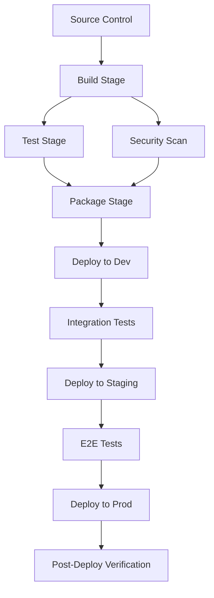

# CI/CD 파이프라인 및 배포 전략

## 1. 개요

Gaesup-State의 CI/CD 파이프라인은 멀티 프레임워크 WASM 컨테이너 환경의 복잡성을 고려하여 설계됩니다. 각 Unit(컨테이너)의 독립적인 배포, 다양한 런타임 환경(Browser, Node.js, WASM)에 대한 크로스 플랫폼 빌드, 그리고 안전한 배포 전략을 지원합니다.

### 핵심 목표
- **독립적 Unit 배포**: 각 Unit의 독립적인 빌드, 테스트, 배포
- **크로스 플랫폼 지원**: Browser, Node.js, Docker, WASM 런타임 환경
- **안전한 배포**: Blue-Green, Canary, A/B 테스트 지원
- **자동화된 품질 보증**: 자동화된 테스트, 보안 스캔, 성능 검증
- **롤백 지원**: 빠른 롤백 및 복구 메커니즘

## 2. 파이프라인 아키텍처

### 2.1 Multi-Stage Pipeline

```typescript
interface PipelineStage {
  name: string;
  dependencies: string[];
  parallelizable: boolean;
  timeout: number;
  retryCount: number;
}

interface PipelineConfig {
  stages: {
    source: PipelineStage;
    build: PipelineStage;
    test: PipelineStage;
    security: PipelineStage;
    package: PipelineStage;
    deploy: PipelineStage;
    verify: PipelineStage;
  };
  environments: Environment[];
  triggers: PipelineTrigger[];
}

interface Environment {
  name: 'development' | 'staging' | 'production';
  cluster: string;
  namespace: string;
  replicas: number;
  resources: ResourceLimits;
  approvalRequired: boolean;
}
```

### 2.2 Pipeline Workflow



## 3. 빌드 시스템

### 3.1 Rust-WASM 빌드

```yaml
# .github/workflows/rust-build.yml
name: Rust WASM Build
on:
  push:
    paths: ['packages/core-rust/**']

jobs:
  build-wasm:
    runs-on: ubuntu-latest
    steps:
      - uses: actions/checkout@v4
      - name: Setup Rust
        uses: dtolnay/rust-toolchain@stable
        with:
          targets: wasm32-unknown-unknown
      
      - name: Install wasm-pack
        run: curl https://rustwasm.github.io/wasm-pack/installer/init.sh -sSf | sh
      
      - name: Build WASM
        working-directory: packages/core-rust
        run: |
          wasm-pack build --target web --out-dir pkg
          wasm-pack build --target nodejs --out-dir pkg-node
          wasm-pack build --target bundler --out-dir pkg-bundler
      
      - name: Optimize WASM
        run: |
          wasm-opt -Oz -o pkg/core_rust_bg.wasm pkg/core_rust_bg.wasm
          wasm-opt -Oz -o pkg-node/core_rust_bg.wasm pkg-node/core_rust_bg.wasm
      
      - name: Upload artifacts
        uses: actions/upload-artifact@v4
        with:
          name: wasm-artifacts
          path: packages/core-rust/pkg*
```

### 3.2 TypeScript 빌드

```typescript
// build-system/BuildManager.ts
export class BuildManager {
  private buildConfig: BuildConfig;
  
  async buildPackage(packageName: string): Promise<BuildResult> {
    const config = this.buildConfig.packages[packageName];
    const builder = this.createBuilder(config.type);
    
    try {
      // 1. 소스 코드 검증
      await this.validateSource(packageName);
      
      // 2. 의존성 해결
      await this.resolveDependencies(packageName);
      
      // 3. 타입 검사
      await this.typeCheck(packageName);
      
      // 4. 빌드 실행
      const result = await builder.build(config);
      
      // 5. 번들 최적화
      await this.optimizeBundle(result);
      
      return result;
    } catch (error) {
      throw new BuildError(`Build failed for ${packageName}`, error);
    }
  }
  
  private createBuilder(type: BuildType): Builder {
    switch (type) {
      case 'library': return new LibraryBuilder();
      case 'application': return new ApplicationBuilder();
      case 'container': return new ContainerBuilder();
      default: throw new Error(`Unknown build type: ${type}`);
    }
  }
}

interface BuildConfig {
  packages: Record<string, PackageBuildConfig>;
  global: GlobalBuildConfig;
}

interface PackageBuildConfig {
  type: 'library' | 'application' | 'container';
  entry: string;
  output: string;
  target: 'web' | 'node' | 'universal';
  optimization: OptimizationConfig;
  externals: string[];
}
```

## 4. 테스트 전략

### 4.1 테스트 계층

```typescript
// testing/TestSuite.ts
export class TestSuite {
  async runAllTests(): Promise<TestReport> {
    const results = await Promise.all([
      this.runUnitTests(),
      this.runIntegrationTests(),
      this.runE2ETests(),
      this.runPerformanceTests(),
      this.runSecurityTests()
    ]);
    
    return this.generateReport(results);
  }
  
  async runUnitTests(): Promise<TestResult[]> {
    // Rust 단위 테스트
    const rustTests = await this.runRustTests();
    
    // TypeScript 단위 테스트
    const tsTests = await this.runJestTests();
    
    // 프레임워크별 테스트
    const frameworkTests = await this.runFrameworkTests();
    
    return [...rustTests, ...tsTests, ...frameworkTests];
  }
  
  async runIntegrationTests(): Promise<TestResult[]> {
    // WASM-JS 통합 테스트
    const wasmIntegration = await this.testWasmIntegration();
    
    // 프레임워크 간 상태 동기화 테스트
    const stateSync = await this.testStateSynchronization();
    
    // 컨테이너 라이프사이클 테스트
    const lifecycle = await this.testContainerLifecycle();
    
    return [wasmIntegration, stateSync, lifecycle];
  }
}

interface TestResult {
  suite: string;
  passed: number;
  failed: number;
  skipped: number;
  duration: number;
  coverage: CoverageReport;
  failures: TestFailure[];
}
```

### 4.2 성능 테스트

```typescript
// testing/PerformanceTest.ts
export class PerformanceTestRunner {
  async benchmarkStateOperations(): Promise<BenchmarkResult> {
    const scenarios = [
      { name: 'Simple Update', operations: 10000 },
      { name: 'Complex State Tree', operations: 5000 },
      { name: 'Cross-Container Sync', operations: 1000 },
      { name: 'Memory Pressure', operations: 50000 }
    ];
    
    const results = [];
    
    for (const scenario of scenarios) {
      const result = await this.runBenchmark(scenario);
      results.push(result);
      
      // 성능 임계값 검증
      await this.validatePerformanceThreshold(result);
    }
    
    return this.generateBenchmarkReport(results);
  }
  
  private async validatePerformanceThreshold(result: BenchmarkResult): Promise<void> {
    const thresholds = {
      'Simple Update': { maxLatency: 1, minThroughput: 50000 },
      'Complex State Tree': { maxLatency: 5, minThroughput: 10000 },
      'Cross-Container Sync': { maxLatency: 10, minThroughput: 1000 },
      'Memory Pressure': { maxMemoryUsage: 100 } // MB
    };
    
    const threshold = thresholds[result.scenario];
    if (!threshold) return;
    
    if (result.avgLatency > threshold.maxLatency) {
      throw new PerformanceError(`Latency threshold exceeded: ${result.avgLatency}ms > ${threshold.maxLatency}ms`);
    }
    
    if (result.throughput < threshold.minThroughput) {
      throw new PerformanceError(`Throughput threshold not met: ${result.throughput} < ${threshold.minThroughput}`);
    }
  }
}
```

## 5. 보안 스캔

### 5.1 정적 분석

```yaml
# .github/workflows/security-scan.yml
name: Security Scan
on: [push, pull_request]

jobs:
  security-scan:
    runs-on: ubuntu-latest
    steps:
      - uses: actions/checkout@v4
      
      # Rust 보안 스캔
      - name: Rust Security Audit
        run: |
          cargo install cargo-audit
          cd packages/core-rust
          cargo audit
      
      # Node.js 취약점 스캔
      - name: npm audit
        run: |
          pnpm audit --audit-level moderate
      
      # SAST (Static Application Security Testing)
      - name: Run Semgrep
        uses: semgrep/semgrep-action@v1
        with:
          config: >-
            p/security-audit
            p/secrets
            p/typescript
            p/rust
      
      # 의존성 취약점 스캔
      - name: Snyk Security Scan
        uses: snyk/actions/node@master
        env:
          SNYK_TOKEN: ${{ secrets.SNYK_TOKEN }}
```

### 5.2 동적 보안 테스트

```typescript
// security/SecurityTestSuite.ts
export class SecurityTestSuite {
  async runSecurityTests(): Promise<SecurityTestResult> {
    const tests = [
      this.testWasmSandboxing(),
      this.testXSSPrevention(),
      this.testCSRFProtection(),
      this.testDataValidation(),
      this.testPermissionEscalation(),
      this.testResourceExhaustion()
    ];
    
    const results = await Promise.all(tests);
    return this.generateSecurityReport(results);
  }
  
  private async testWasmSandboxing(): Promise<SecurityTest> {
    // WASM 샌드박싱 테스트
    const maliciousPayloads = [
      { name: 'Memory Access Violation', payload: this.generateMemoryViolation() },
      { name: 'Infinite Loop', payload: this.generateInfiniteLoop() },
      { name: 'Import Violation', payload: this.generateImportViolation() }
    ];
    
    const results = [];
    for (const payload of maliciousPayloads) {
      try {
        await this.executeInSandbox(payload.payload);
        results.push({ name: payload.name, status: 'FAILED', reason: 'Payload executed successfully' });
      } catch (error) {
        if (error instanceof SecurityViolationError) {
          results.push({ name: payload.name, status: 'PASSED', reason: 'Properly blocked' });
        } else {
          results.push({ name: payload.name, status: 'ERROR', reason: error.message });
        }
      }
    }
    
    return { category: 'WASM Sandboxing', tests: results };
  }
}
```

## 6. 컨테이너화 및 패키징

### 6.1 Docker 이미지 빌드

```dockerfile
# Dockerfile.unit
FROM node:18-alpine AS builder

# 빌드 의존성 설치
WORKDIR /build
COPY package*.json pnpm-*.yaml ./
RUN npm install -g pnpm && pnpm install

# 소스 코드 복사 및 빌드
COPY . .
RUN pnpm run build

# 프로덕션 이미지
FROM node:18-alpine AS runtime

# 보안 최적화
RUN addgroup -g 1001 -S nodejs && \
    adduser -S gaesup -u 1001

WORKDIR /app
COPY --from=builder --chown=gaesup:nodejs /build/dist ./dist
COPY --from=builder --chown=gaesup:nodejs /build/package.json ./

# 런타임 의존성만 설치
RUN npm install --only=production && npm cache clean --force

USER gaesup
EXPOSE 3000

HEALTHCHECK --interval=30s --timeout=3s --start-period=5s --retries=3 \
  CMD node healthcheck.js

CMD ["node", "dist/index.js"]
```

### 6.2 Helm 차트

```yaml
# helm/gaesup-unit/templates/deployment.yaml
apiVersion: apps/v1
kind: Deployment
metadata:
  name: {{ include "gaesup-unit.fullname" . }}
  labels:
    {{- include "gaesup-unit.labels" . | nindent 4 }}
spec:
  replicas: {{ .Values.replicaCount }}
  strategy:
    type: RollingUpdate
    rollingUpdate:
      maxUnavailable: 1
      maxSurge: 1
  selector:
    matchLabels:
      {{- include "gaesup-unit.selectorLabels" . | nindent 6 }}
  template:
    metadata:
      annotations:
        prometheus.io/scrape: "true"
        prometheus.io/port: "3000"
        prometheus.io/path: "/metrics"
      labels:
        {{- include "gaesup-unit.selectorLabels" . | nindent 8 }}
    spec:
      containers:
      - name: {{ .Chart.Name }}
        image: "{{ .Values.image.repository }}:{{ .Values.image.tag }}"
        imagePullPolicy: {{ .Values.image.pullPolicy }}
        ports:
        - name: http
          containerPort: 3000
          protocol: TCP
        livenessProbe:
          httpGet:
            path: /health
            port: http
          initialDelaySeconds: 30
          periodSeconds: 10
        readinessProbe:
          httpGet:
            path: /ready
            port: http
          initialDelaySeconds: 5
          periodSeconds: 5
        resources:
          {{- toYaml .Values.resources | nindent 10 }}
        env:
        - name: NODE_ENV
          value: {{ .Values.env.nodeEnv }}
        - name: LOG_LEVEL
          value: {{ .Values.env.logLevel }}
```

## 7. 배포 전략

### 7.1 Blue-Green 배포

```typescript
// deployment/BlueGreenDeployment.ts
export class BlueGreenDeployment {
  private kubernetesClient: KubernetesClient;
  private loadBalancer: LoadBalancer;
  
  async deploy(unitSpec: UnitDeploymentSpec): Promise<DeploymentResult> {
    // 1. 현재 활성 환경 확인 (Blue/Green)
    const currentEnv = await this.getCurrentActiveEnvironment(unitSpec.unitId);
    const targetEnv = currentEnv === 'blue' ? 'green' : 'blue';
    
    // 2. 대상 환경에 새 버전 배포
    await this.deployToEnvironment(unitSpec, targetEnv);
    
    // 3. 헬스 체크 및 검증
    const healthCheck = await this.performHealthCheck(unitSpec.unitId, targetEnv);
    if (!healthCheck.healthy) {
      throw new DeploymentError('Health check failed', healthCheck.errors);
    }
    
    // 4. 스모크 테스트 실행
    const smokeTest = await this.runSmokeTests(unitSpec.unitId, targetEnv);
    if (!smokeTest.passed) {
      throw new DeploymentError('Smoke tests failed', smokeTest.failures);
    }
    
    // 5. 트래픽 전환
    await this.switchTraffic(unitSpec.unitId, currentEnv, targetEnv);
    
    // 6. 모니터링 및 롤백 준비
    await this.monitorDeployment(unitSpec.unitId, targetEnv);
    
    return {
      unitId: unitSpec.unitId,
      version: unitSpec.version,
      environment: targetEnv,
      deployedAt: new Date(),
      status: 'SUCCESS'
    };
  }
  
  private async switchTraffic(unitId: string, from: Environment, to: Environment): Promise<void> {
    // 점진적 트래픽 전환 (0% -> 10% -> 50% -> 100%)
    const stages = [10, 50, 100];
    
    for (const percentage of stages) {
      await this.loadBalancer.updateTrafficSplit(unitId, {
        [from]: 100 - percentage,
        [to]: percentage
      });
      
      // 각 단계에서 메트릭 확인
      await this.waitForStabilization(60000); // 1분 대기
      
      const metrics = await this.collectMetrics(unitId, to);
      if (!this.validateMetrics(metrics)) {
        // 문제 발생 시 즉시 롤백
        await this.rollback(unitId, from, to);
        throw new DeploymentError('Metrics validation failed during traffic switch');
      }
    }
  }
}
```

### 7.2 Canary 배포

```typescript
// deployment/CanaryDeployment.ts
export class CanaryDeployment {
  async deployCanary(unitSpec: UnitDeploymentSpec, canaryConfig: CanaryConfig): Promise<CanaryDeploymentResult> {
    // 1. Canary 버전 배포 (소규모 트래픽)
    const canaryId = await this.deployCanaryVersion(unitSpec, canaryConfig.trafficPercentage);
    
    // 2. A/B 테스트 설정
    await this.setupABTest(unitSpec.unitId, canaryId, canaryConfig.abTestConfig);
    
    // 3. 메트릭 수집 및 분석
    const analysisResult = await this.runCanaryAnalysis(canaryId, canaryConfig.analysisConfig);
    
    // 4. 자동 의사결정
    if (analysisResult.recommendation === 'PROMOTE') {
      return await this.promoteCanary(canaryId);
    } else if (analysisResult.recommendation === 'ABORT') {
      return await this.abortCanary(canaryId);
    } else {
      return await this.continueCanary(canaryId, analysisResult.suggestions);
    }
  }
  
  private async runCanaryAnalysis(canaryId: string, config: CanaryAnalysisConfig): Promise<CanaryAnalysisResult> {
    const metrics = await this.collectCanaryMetrics(canaryId, config.duration);
    const baseline = await this.getBaselineMetrics(canaryId);
    
    const analysis = {
      errorRate: this.compareErrorRates(metrics.errorRate, baseline.errorRate),
      latency: this.compareLatencies(metrics.latency, baseline.latency),
      throughput: this.compareThroughput(metrics.throughput, baseline.throughput),
      userSatisfaction: this.compareUserMetrics(metrics.userMetrics, baseline.userMetrics)
    };
    
    // 통계적 유의성 검증
    const statisticalSignificance = this.calculateStatisticalSignificance(metrics, baseline);
    
    // 의사결정 알고리즘
    if (analysis.errorRate.degradation > config.thresholds.maxErrorRateIncrease) {
      return { recommendation: 'ABORT', reason: 'Error rate increased significantly' };
    }
    
    if (analysis.latency.degradation > config.thresholds.maxLatencyIncrease) {
      return { recommendation: 'ABORT', reason: 'Latency increased significantly' };
    }
    
    if (statisticalSignificance.confidence > 0.95 && analysis.overall.improvement > 0) {
      return { recommendation: 'PROMOTE', reason: 'Statistically significant improvement' };
    }
    
    return { recommendation: 'CONTINUE', suggestions: this.generateOptimizationSuggestions(analysis) };
  }
}
```

## 8. 모니터링 및 알림

### 8.1 배포 모니터링

```typescript
// monitoring/DeploymentMonitor.ts
export class DeploymentMonitor {
  private prometheusClient: PrometheusClient;
  private alertManager: AlertManager;
  
  async monitorDeployment(deploymentId: string): Promise<MonitoringSession> {
    const session = new MonitoringSession(deploymentId);
    
    // 1. 실시간 메트릭 수집
    session.addMetricCollector('response_time', {
      query: `histogram_quantile(0.95, rate(http_request_duration_seconds_bucket{deployment="${deploymentId}"}[5m]))`,
      threshold: { warning: 0.5, critical: 1.0 }
    });
    
    session.addMetricCollector('error_rate', {
      query: `rate(http_requests_total{deployment="${deploymentId}",status=~"5.."}[5m])`,
      threshold: { warning: 0.01, critical: 0.05 }
    });
    
    session.addMetricCollector('memory_usage', {
      query: `container_memory_usage_bytes{deployment="${deploymentId}"}`,
      threshold: { warning: 0.8, critical: 0.9 }
    });
    
    // 2. 비즈니스 메트릭 모니터링
    session.addBusinessMetric('conversion_rate', {
      query: `rate(business_conversions_total{deployment="${deploymentId}"}[5m])`,
      baselineComparison: true
    });
    
    // 3. 알림 규칙 설정
    session.addAlertRule({
      name: 'deployment_high_error_rate',
      condition: 'error_rate > 0.05',
      duration: '2m',
      action: 'auto_rollback'
    });
    
    // 4. 자동 액션 설정
    session.onThresholdExceeded('critical', async (metric, value) => {
      await this.triggerEmergencyRollback(deploymentId);
      await this.alertManager.sendCriticalAlert({
        deployment: deploymentId,
        metric: metric.name,
        value,
        action: 'auto_rollback_initiated'
      });
    });
    
    return session;
  }
}
```

### 8.2 알림 시스템

```typescript
// monitoring/AlertSystem.ts
export class AlertSystem {
  private channels: NotificationChannel[];
  
  async sendDeploymentAlert(alert: DeploymentAlert): Promise<void> {
    const notification = this.formatNotification(alert);
    
    // 알림 우선순위에 따른 채널 선택
    const selectedChannels = this.selectChannels(alert.severity);
    
    await Promise.all(
      selectedChannels.map(channel => channel.send(notification))
    );
  }
  
  private formatNotification(alert: DeploymentAlert): Notification {
    const templates = {
      slack: this.formatSlackMessage(alert),
      email: this.formatEmailMessage(alert),
      webhook: this.formatWebhookPayload(alert)
    };
    
    return {
      title: `🚨 Deployment Alert: ${alert.unitId}`,
      message: alert.message,
      severity: alert.severity,
      metadata: alert.metadata,
      templates
    };
  }
  
  private formatSlackMessage(alert: DeploymentAlert): SlackMessage {
    const colorMap = {
      info: '#36a64f',
      warning: '#ffcc00',
      critical: '#ff0000'
    };
    
    return {
      attachments: [{
        color: colorMap[alert.severity],
        title: `Deployment ${alert.unitId} - ${alert.severity.toUpperCase()}`,
        text: alert.message,
        fields: [
          { title: 'Version', value: alert.version, short: true },
          { title: 'Environment', value: alert.environment, short: true },
          { title: 'Time', value: alert.timestamp.toISOString(), short: true },
          { title: 'Action Required', value: alert.actionRequired ? 'Yes' : 'No', short: true }
        ],
        actions: alert.actions?.map(action => ({
          type: 'button',
          text: action.label,
          url: action.url
        })) || []
      }]
    };
  }
}
```

## 9. 롤백 및 복구

### 9.1 자동 롤백

```typescript
// deployment/AutoRollback.ts
export class AutoRollbackSystem {
  private deploymentHistory: DeploymentHistory;
  private healthChecker: HealthChecker;
  
  async setupAutoRollback(deploymentId: string, config: RollbackConfig): Promise<void> {
    const watcher = new DeploymentWatcher(deploymentId);
    
    watcher.onHealthCheckFailure(async (failure) => {
      if (failure.consecutiveFailures >= config.healthCheckThreshold) {
        await this.initiateRollback(deploymentId, 'health_check_failure');
      }
    });
    
    watcher.onMetricThresholdExceeded(async (metric, value) => {
      if (metric.name === 'error_rate' && value > config.errorRateThreshold) {
        await this.initiateRollback(deploymentId, 'error_rate_exceeded');
      }
    });
    
    watcher.onUserTrafficDrop(async (trafficDrop) => {
      if (trafficDrop.percentage > config.trafficDropThreshold) {
        await this.initiateRollback(deploymentId, 'traffic_drop');
      }
    });
  }
  
  private async initiateRollback(deploymentId: string, reason: string): Promise<RollbackResult> {
    console.log(`🔄 Initiating automatic rollback for ${deploymentId}: ${reason}`);
    
    // 1. 이전 안정 버전 식별
    const previousVersion = await this.deploymentHistory.getLastStableVersion(deploymentId);
    if (!previousVersion) {
      throw new RollbackError('No stable version available for rollback');
    }
    
    // 2. 긴급 트래픽 전환
    await this.emergencyTrafficSwitch(deploymentId, previousVersion);
    
    // 3. 롤백 실행
    const rollbackResult = await this.executeRollback(deploymentId, previousVersion);
    
    // 4. 검증
    await this.verifyRollback(deploymentId, previousVersion);
    
    // 5. 알림
    await this.notifyRollbackCompletion(deploymentId, reason, rollbackResult);
    
    return rollbackResult;
  }
  
  private async emergencyTrafficSwitch(deploymentId: string, targetVersion: string): Promise<void> {
    // 즉시 트래픽을 안전한 버전으로 전환
    await this.loadBalancer.emergencySwitch(deploymentId, targetVersion);
    
    // 짧은 대기 후 확인
    await this.waitForStabilization(5000);
    
    const health = await this.healthChecker.check(deploymentId);
    if (!health.healthy) {
      throw new RollbackError('Emergency traffic switch failed');
    }
  }
}
```

## 10. 운영 도구 및 대시보드

### 10.1 배포 대시보드

```typescript
// dashboard/DeploymentDashboard.ts
export class DeploymentDashboard {
  async renderDashboard(): Promise<DashboardView> {
    const data = await this.collectDashboardData();
    
    return {
      sections: [
        {
          title: 'Active Deployments',
          widget: 'deployment-grid',
          data: data.activeDeployments.map(deployment => ({
            unitId: deployment.unitId,
            version: deployment.version,
            environment: deployment.environment,
            status: deployment.status,
            health: deployment.health,
            metrics: {
              uptime: deployment.uptime,
              requestRate: deployment.requestRate,
              errorRate: deployment.errorRate,
              responseTime: deployment.responseTime
            },
            actions: [
              { label: 'View Logs', action: 'view-logs' },
              { label: 'Scale', action: 'scale' },
              { label: 'Rollback', action: 'rollback' }
            ]
          }))
        },
        {
          title: 'Deployment Pipeline',
          widget: 'pipeline-status',
          data: data.pipelineStatus
        },
        {
          title: 'Performance Metrics',
          widget: 'metrics-chart',
          data: data.performanceMetrics
        },
        {
          title: 'Recent Activities',
          widget: 'activity-log',
          data: data.recentActivities
        }
      ],
      alerts: data.activeAlerts,
      globalActions: [
        { label: 'Emergency Stop All', action: 'emergency-stop' },
        { label: 'Global Rollback', action: 'global-rollback' }
      ]
    };
  }
}
```

### 10.2 CLI 도구

```typescript
// cli/DeploymentCLI.ts
export class DeploymentCLI {
  @Command('deploy')
  async deploy(
    @Argument('unit-id') unitId: string,
    @Option('--version') version: string,
    @Option('--environment') environment: string,
    @Option('--strategy') strategy: 'blue-green' | 'canary' | 'rolling' = 'rolling'
  ): Promise<void> {
    console.log(`🚀 Starting deployment of ${unitId}:${version} to ${environment}`);
    
    const deploymentSpec: UnitDeploymentSpec = {
      unitId,
      version,
      environment,
      strategy
    };
    
    const deployment = this.createDeploymentStrategy(strategy);
    const result = await deployment.deploy(deploymentSpec);
    
    console.log(`✅ Deployment completed: ${result.status}`);
  }
  
  @Command('rollback')
  async rollback(
    @Argument('unit-id') unitId: string,
    @Option('--version') version?: string,
    @Option('--reason') reason?: string
  ): Promise<void> {
    const rollbackSystem = new AutoRollbackSystem();
    const result = await rollbackSystem.initiateRollback(unitId, reason || 'manual');
    
    console.log(`🔄 Rollback completed: ${result.status}`);
  }
  
  @Command('status')
  async status(@Argument('unit-id') unitId?: string): Promise<void> {
    if (unitId) {
      const status = await this.getUnitStatus(unitId);
      this.displayUnitStatus(status);
    } else {
      const overview = await this.getOverviewStatus();
      this.displayOverview(overview);
    }
  }
}
```

이 CI/CD 파이프라인은 Gaesup-State의 복잡한 멀티 프레임워크 WASM 환경을 고려하여 설계되었으며, 안전하고 효율적인 배포를 보장합니다. 